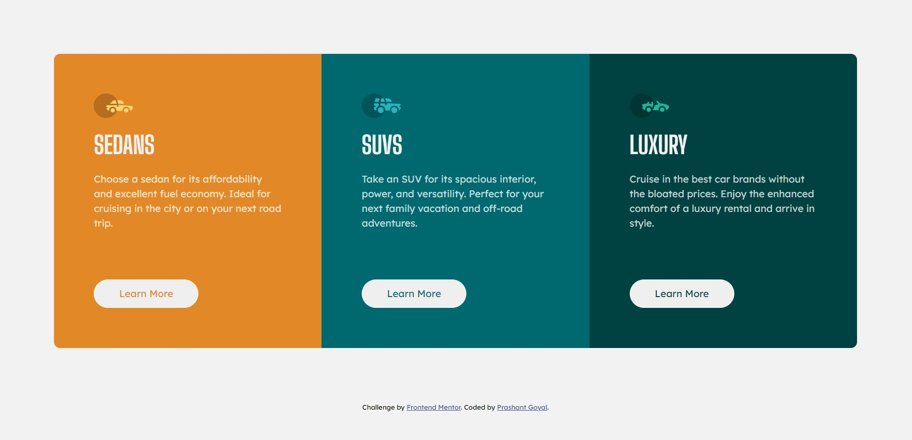
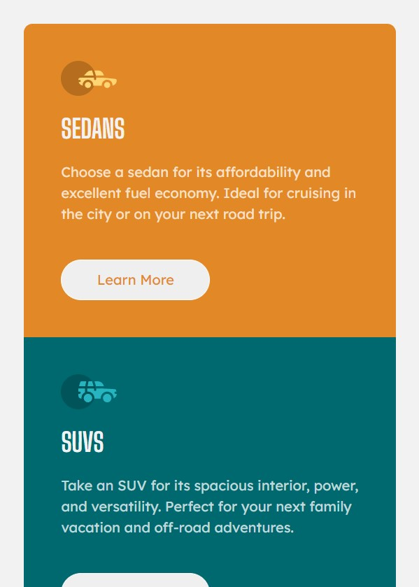

# Frontend Mentor - 3-column preview card component solution

This is a solution to the [3-column preview card component challenge on Frontend Mentor](https://www.frontendmentor.io/challenges/3column-preview-card-component-pH92eAR2-). Frontend Mentor challenges help you improve your coding skills by building realistic projects. 

## Table of contents

- [Overview](#overview)
  - [The challenge](#the-challenge)
  - [Screenshot](#screenshot)
  - [Links](#links)
- [My process](#my-process)
  - [Built with](#built-with)
  - [Continued development](#continued-development)
- [Author](#author)

## Overview

### The challenge

Users should be able to:

- View the optimal layout depending on their device's screen size
- See hover states for interactive elements

### Screenshots

### Links

- Solution URL: [Link to Github](https://github.com/myidispg/frontend_mentor_practice/tree/main/3-column-preview-card-component-main)
- Live Site URL: [Add live site URL here](https://myidispg.github.io/frontend_mentor_practice/3-column-preview-card-component-main/index.html)

## My process

### Built with

- Semantic HTML5 markup
- CSS custom properties
- Bootstrap

### Continued development

Learnt to add device specific code to optimize layout for different screen sizes.

## Author

- Website - [Prashant Goyal](https://github.com/myidispg/)
- Frontend Mentor - [@myidispg](https://www.frontendmentor.io/profile/myidispg)
- Twitter - [@myidispg](https://www.twitter.com/myidispg) (I don't post a lot)
