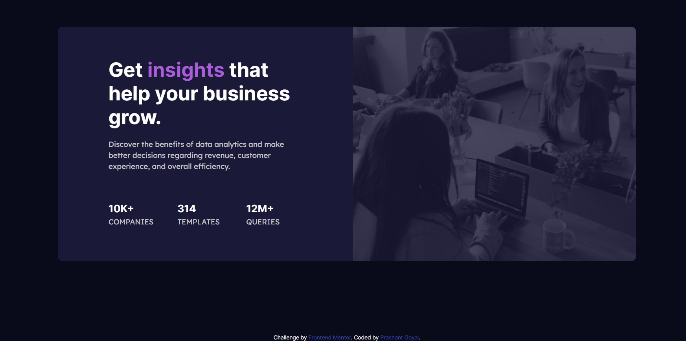

# Frontend Mentor - Stats preview card component solution

This is a solution to the [Stats preview card component challenge on Frontend Mentor](https://www.frontendmentor.io/challenges/stats-preview-card-component-8JqbgoU62). Frontend Mentor challenges help you improve your coding skills by building realistic projects. 

## Table of contents

- [Overview](#overview)
  - [The challenge](#the-challenge)
  - [Personal Challenge](#personal-challenge)
  - [Screenshot](#screenshot)
  - [Links](#links)
- [My process](#my-process)
  - [Built with](#built-with)
  - [Continued development](#continued-development)
  - [Useful resources](#useful-resources)
- [Author](#author)
- [Acknowledgments](#acknowledgments)

## Overview

### The challenge

Users should be able to:

- View the optimal layout depending on their device's screen size.

### Personal challenge
Since I am just starting out, I made the challenge easier for me and just wanted to achieve the required look on a desktop screen.

### Screenshot

### Links

- Solution URL: [This repository is the solution](https://github.com/myidispg/frontend_mentor_practice)

## My process

### Built with

- Semantic HTML5 markup
- CSS custom properties
- Flexbox
- CSS Grid
- Bootstrap5
- [Google Fonts](https://fonts.google.com/) - Google Fonts 

### Continued development
Since this one is optimized just for the desktop and large screen devices, next step would naturally be to build sites optimized for tablet, mobile and other smaller screen devices too. 

### Useful resources

- [Bootstrap Getting Started](https://getbootstrap.com/docs/5.0/getting-started/download/) - This should be enough to describe it - "Documentation is very important"

## Author

- Github - [Prashant Goyal](https://www.github.com/myidispg)
- Frontend Mentor - [@yourusername](https://www.frontendmentor.io/profile/myidispg)
- Twitter - [@myidispg](https://www.twitter.com/myidispg) (I don't post a lot)

